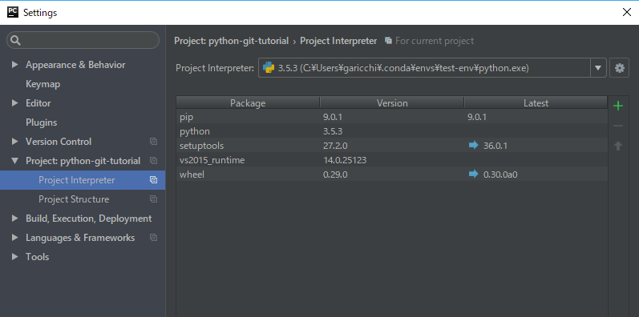

# PYTHON GIT TUTORIAL
## なにこのリポジトリ
第2回自主ゼミ用pythonとgitを学べるありがたいリポジトリ

## 想定環境
- Windows
- Anaconda
- PyCharm
- Git for Windows

## リポジトリをクローンしよう
- リモートサーバーにあるリポジトリを自分のローカルリポジトリへコピーすることをクローンと言います
- ```git clone {リモートリポジトリのURL}```でクローンできます
- bash環境だとやりやすいのでgit bashというプログラムを使用して作業を進めます
- ```git bash```というプログラムを起動します

```sh
# ホームディレクトリへ移動
cd ~
# 作業ディレクトリの作成
mkdir projects
# 作業ディレクトリへ移動
cd projects
# リポジトリをclone
git clone https://garicchi@gitlab.com/nist-lab/python-git-tutorial.git
# リポジトリへ移動
cd python-git-tutorial
```
エラーが表示されなければOKです。
エクスプローラーで見るとリポジトリのフォルダができています。


## Python仮想環境を作ろう
- インストールしてもらったAnacondaを利用するとPythonの仮想環境を作成できます
- ```conda create```コマンドで仮想環境を作成できます
- 今回は```tes-env```という名前の仮想環境を作成しましょう
- 仮想環境を切り替えるときは```source activate {env name}```コマンドを実行します

```sh
# python3.5で test-envという名前の仮想環境を作成する
# 途中でProceed ([y]/n)?と出たらyを押す
conda create -n test-env python=3.5
# 現在作成されている仮想環境を確認する
# test-envの仮想環境があり、現在root仮想環境のほうにいることを確認する
conda env list
# test-env仮想環境のアクティベート
source activate test-env

```
仮想環境に入っているときはgit bashに仮想環境の名前が表示されています


仮想環境をアクティベートしている状態でpip installなどでパッケージをインストールするとすべて仮想環境の中に入ります

## Pycharmで開いてみよう
- Pycharmを起動
- ```Open```を押す
- クローンしたpython-git-tutorialリポジトリを開く

## Pycharmに仮想環境を読み込ませよう

- メニューバーから[File]>[Settings...]を開く
- 左側のツリーから[Project:python-git-tutorial]を開き、[Project Interpreter]を開く
- 歯車ボタンを押す>[Add Local]を押す
- ```C:\Users\{User Name}\.conda\envs\test-env\python.exe```を選択する
- OKを押す


## 実行してみよう
- ```1-hello.py```を実行してみよう
- 右上の三角形(下図参照)から[Edit Configurations...]を選択します


- ダイアログが出てきたら[+]ボタンを押して[Python]を選びます


- [Name]に好きな名前を入力し、[Script]欄に実行したいスクリプトを指定します

- OKを押します

- 緑色の三角形を押して実行します


- Hello,World!と表示されればOKです


## コンソールから実行してみよう
- git bashで以下のコマンドを打ちます
- ```python 1-hello.py```
- Hello,World!と表示されればOKです

## 表示される文章を変えてみよう
