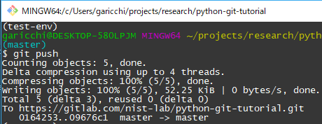

# PYTHON GIT TUTORIAL
## なにこのリポジトリ
第2回自主ゼミ用pythonとgitを学べるありがたいリポジトリ

## 想定環境
- Windows
- Anaconda
- PyCharm
- Git for Windows

## gitlabのアカウントを作成しよう
- がんばれ当日の俺

## リモートリポジトリを作成しよう
- GitLabにログインします
- [Projects]タブに移動し、[New project]ボタンを押します


- Project nameを```python-git-tutorial```とし、Create projectボタンを押します
- Visiblity Levelはpublicが望ましいです


- リモートリポジトリを作成できました
- URLが記載してある部分のSSHでHTTPSを選択したときに表示されるURLがリモートリポジトリのURLになります


## リポジトリをクローンしよう
- リモートサーバーにあるリポジトリを自分のローカルリポジトリへコピーすることをクローンと言います
- ```git clone {リモートリポジトリのURL}```でクローンできます
- bash環境だとやりやすいのでgit bashというプログラムを使用して作業を進めます
- ```git bash```というプログラムを起動します

```sh
# ホームディレクトリへ移動
cd ~
# 作業ディレクトリの作成
mkdir projects
# 作業ディレクトリへ移動
cd projects
# リポジトリをclone
git clone {リモートリポジトリのURL}
# リポジトリへ移動
cd python-git-tutorial
```
エラーが表示されなければOKです。
エクスプローラーで見るとリポジトリのフォルダができています。


## Python仮想環境を作ろう
- インストールしてもらったAnacondaを利用するとPythonの仮想環境を作成できます
- ```conda create```コマンドで仮想環境を作成できます
- 今回は```tes-env```という名前の仮想環境を作成しましょう
- 仮想環境を切り替えるときは```source activate {env name}```コマンドを実行します

```sh
# python3.5で test-envという名前の仮想環境を作成する
# 途中でProceed ([y]/n)?と出たらyを押す
conda create -n test-env python=3.5
# 現在作成されている仮想環境を確認する
# test-envの仮想環境があり、現在root仮想環境のほうにいることを確認する
conda env list
# test-env仮想環境のアクティベート
source activate test-env

```
仮想環境に入っているときはgit bashに仮想環境の名前が表示されています


仮想環境をアクティベートしている状態でpip installなどでパッケージをインストールするとすべて仮想環境の中に入ります

## Pycharmで開いてみよう
- Pycharmを起動
- ```Open```を押す
- クローンしたpython-git-tutorialリポジトリを開く

## Pycharmに仮想環境を読み込ませよう

- メニューバーから[File]>[Settings...]を開く
- 左側のツリーから[Project:python-git-tutorial]を開き、[Project Interpreter]を開く
- 歯車ボタンを押す>[Add Local]を押す
- ```C:\Users\{User Name}\.conda\envs\test-env\python.exe```を選択する
- OKを押す


## Pythonスクリプトを作成して書こう
- Pythonスクリプトを新しく作成します
- python-git-tutorialフォルダを右クリックして[New]>[Python file]を選択します


- ```1-hello.py```と入力し、OKを押します


- 作成された```1-hello.py```ファイルに以下のコードを記載しましょう

```py
if __name__ == '__main__':
    print('This is Python')
```


## 実行しよう
- ```1-hello.py```を実行してみよう
- 右上の三角形(下図参照)から[Edit Configurations...]を選択します


- ダイアログが出てきたら[+]ボタンを押して[Python]を選びます


- [Name]に好きな名前を入力し、[Script]欄に実行したいスクリプトを指定します

- OKを押します

- 緑色の三角形を押して実行します


- Hello,World!と表示されればOKです


## コンソールから実行してみよう
- git bashで以下のコマンドを打ちます
- ```python 1-hello.py```
- Hello,World!と表示されればOKです

## 表示される文章を変えてみよう
- 現在、Hello,Worldと表示されているが1-hello.pyを編集して「This is Python」と表示するようにします
- 同様の手順で実行し、「This is Python」と表示されればOKです


## gitで変更をコミットしてみよう
- 先ほど、リポジトリ内でファイルを編集しました
- ```git status```コマンドを実行してみましょう
- このコマンドは現在のリポジトリの状況を表示してくれます


- 赤文字で「modified: 1-hello.py」と表示されています
- つまり、「1-hello.pyというファイルが編集されたぞ」と教えてくれています
- ```git diff```コマンドを利用するとどこが変更されたのかも教えてくれます


- では変更をコミットしましょう
- gitではコミット前に、コミットするファイルをindexという場所へ追加する必要があります
- 変更をindexへ追加するには```git add```コマンドを利用します
- 以下のコマンドを実行しましょう

```sh
# 現在のカレントディレクトリ以下のファイルをすべてindexに追加する(コミット対象とする)
git add .
```

- 現在変更されているファイルは1-hello.pyのみなので上記のコマンドは```git add 1-hello.py```を実行したときと同じ意味を持ちます
- 再び```git status```コマンドを実行してリポジトリの状態を見ましょう


- 先ほど赤色だった1-hello.pyが緑色になっています
- これで変更をindexへと追加できました(このことをstageといいます)
- indexへと追加できたらコミット準備は完了です
- 以下のコマンドを実行してコミットしましょう

```sh
# -m オプション以降はコミットメッセージ
# そのコミットで何を変更したのかを1行で分かりやすく書く
git commit -m "fix 1-hello"
```
- コミットが完了しました


## リモートリポジトリへプッシュしよう
- 先ほどのコミットはローカルリポジトリにコミットしたもので、まだリモートリポジトリへは反映されていません
- ```git push```コマンドによってリモートリポジトリにプッシュしましょう
- エラーが出なければ成功です


- GitLabのページを更新すると、コミットしたソースコードの変更が反映されていることがわかります


## チャレンジ！
- では同じリポジトリに```2-loop.py```というファイルを作成して0～10のsin波の値を表示してみましょう
- 完成した表示はこんな感じ


### ヒント
- sinの値を表示するにはnumpyというライブラリのsin関数を使用する必要がある
- numpyライブラリを使用するには```pip install numpy```というコマンドをgit bashにうってインストールする必要がある
- 0～10までをforループをするには```for i in range(0,10):```

